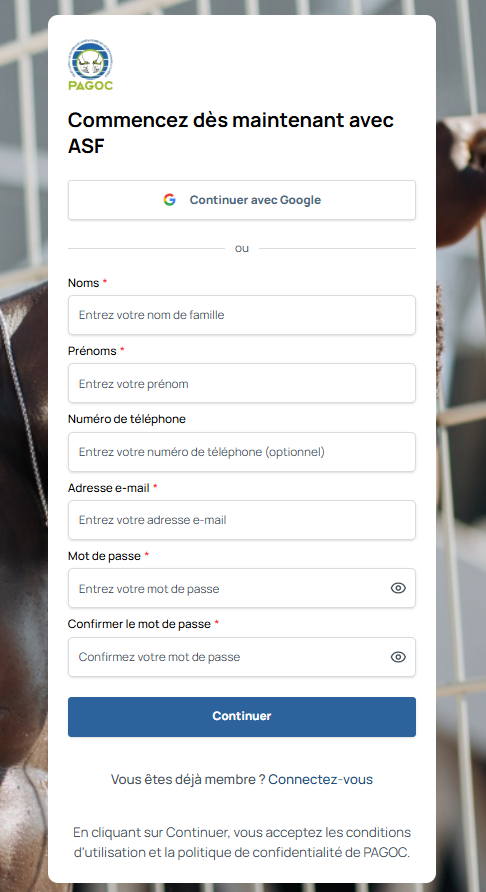

Comment créer votre compte et vous connecter
==========================================

Premiers pas sur PAGOC MOOC
--------------------------

Bienvenue ! Pour commencer votre formation sur PAGOC MOOC, vous devez d'abord 
créer votre compte. Ne vous inquiétez pas, c'est très simple et ne prend que 
quelques minutes.

Créer votre compte
------------------

**Étape 1 : Accéder à la page d'inscription**

1. Allez sur le site de PAGOC MOOC
2. Cliquez sur "S'inscrire" dans le menu
3. Vous arriverez sur la page d'inscription

**Étape 2 : Remplir le formulaire**

Vous devrez fournir ces informations :

**Informations personnelles**
- **Nom** : Votre nom de famille exact
- **Prénom** : Votre prénom usuel
- **Téléphone** : Optionnel, mais recommandé pour la sécurité
- **Email** : Votre adresse email professionnelle (très important !)
- **Mot de passe** : Choisissez un mot de passe sécurisé
- **Confirmer le mot de passe** : Retapez votre mot de passe

**Conseils pour votre mot de passe :**
- Au moins 8 caractères
- Incluez des chiffres et des symboles
- Évitez les informations personnelles (date de naissance, etc.)
- Notez-le bien dans un endroit sûr

**Étape 3 : Accepter les conditions**

- Lisez les conditions d'utilisation
- Lisez la politique de confidentialité
- Cochez la case pour accepter
- Cliquez sur "S'inscrire"

**Étape 4 : Valider votre email**

1. Vérifiez votre boîte de réception
2. Cherchez l'email de confirmation de PAGOC MOOC
3. Cliquez sur le lien de validation
4. Votre compte est maintenant activé !

**Alternative : Connexion avec Google**

Si vous préférez, vous pouvez utiliser votre compte Google :

1. Cliquez sur "Continuer avec Google"
2. Choisissez votre compte Google
3. Autorisez l'accès aux informations de base
4. Votre compte sera créé automatiquement

Se connecter à votre compte
--------------------------

**Pour vous connecter (si vous avez déjà un compte) :**

1. Cliquez sur "Connectez-vous" en bas de la page d'inscription
2. Entrez votre email et votre mot de passe
3. Cliquez sur "Se connecter"
4. Vous arriverez directement sur votre tableau de bord

**Options de connexion :**
- **"Se souvenir de moi"** : Restez connecté pendant 30 jours
- **"Mot de passe oublié"** : Recevez un lien pour réinitialiser

Problèmes courants et solutions
------------------------------

**"Je n'ai pas reçu l'email de validation"**
- Vérifiez votre dossier "Spam" ou "Indésirables"
- Attendez quelques minutes (parfois l'email met du temps à arriver)
- Ajoutez l'expéditeur dans vos contacts pour éviter le spam

**"Mon mot de passe ne fonctionne pas"**
- Vérifiez que vous n'avez pas activé la touche majuscule
- Cliquez sur "Mot de passe oublié" pour le réinitialiser
- Assurez-vous d'utiliser le bon email

**"Je ne peux pas créer de compte"**
- Vérifiez que votre email est valide
- Essayez avec un navigateur différent
- Contactez le support si le problème persiste

**"Je veux utiliser mon compte Google"**
- Cliquez sur "Continuer avec Google"
- Choisissez le compte que vous voulez utiliser
- Suivez les instructions à l'écran

Votre premier tableau de bord
--------------------------

Une fois connecté, vous découvrirez votre espace personnel :

**Message de bienvenue**
- "Bonjour [Votre Prénom]" 
- Vos points d'expérience (XP)
- Votre niveau actuel

**Menu principal**
- **Dashboard** : Votre page d'accueil
- **Cours** : Le catalogue des 8 modules
- **Mon Apprentissage** : Votre progression
- **À Propos** : En savoir plus sur le projet
- **Contact** : Nous contacter si besoin

**Actions rapides**
- "Continuer à apprendre" : Reprendre votre dernier cours
- "Voir les cours" : Découvrir tous les modules
- "Mon profil" : Modifier vos informations

Conseils pour bien démarrer
--------------------------

**1. Complétez votre profil**
- Ajoutez une photo si vous le souhaitez
- Précisez votre profession
- Indiquez vos objectifs d'apprentissage

**2. Explorez les modules**
- Parcourez les 8 modules disponibles
- Lisez les descriptions pour choisir par où commencer
- Notez les modules qui vous intéressent le plus

**3. Planifiez votre temps**
- Prévoyez 2-3 heures par semaine
- Choisissez des moments calmes pour étudier
- Fixez-vous des objectifs réalistes

**4. Utilisez le support**
- N'hésitez pas à poser des questions
- Consultez la FAQ si vous avez des doutes
- Contactez-nous pour toute difficulté technique

Sécurité de votre compte
-----------------------

**Pour protéger votre compte :**
- Choisissez un mot de passe fort et unique
- Ne partagez jamais vos identifiants
- Déconnectez-vous après utilisation sur ordinateur partagé
- Mettez à jour votre mot de passe régulièrement

**Options de sécurité avancées :**
- Authentification à deux facteurs (recommandée)
- Alertes de connexion sur nouvel appareil
- Historique des connexions consultable

Que faire après l'inscription ?
------------------------------

**Immédiatement après :**
1. **Explorez votre tableau de bord** : Familiarisez-vous avec l'interface
2. **Découvrez les cours** : Parcourez le catalogue des 8 modules
3. **Commencez votre premier module** : Le plus souvent "Introduction au droit pénal"

**Dans les jours qui suivent :**
1. **Planifiez votre emploi du temps** : Quand allez-vous étudier ?
2. **Téléchargez les premiers documents** : Pour étudier hors ligne
3. **Rejoignez les forums** : Échangez avec d'autres apprenants

**Pour votre progression :**
1. **Soyez régulier** : Même 30 minutes par jour font la différence
2. **Faites les quiz** : Pour valider vos connaissances
3. **Demandez de l'aide** : La communauté est là pour vous

Besoin d'aide ?
--------------

**Si vous rencontrez des problèmes :**

**Questions fréquentes**
- Consultez notre FAQ en ligne
- Cherchez dans les forums de discussion
- Vérifiez les guides vidéo disponibles

**Contact direct**
- Email : cap.cameroun@avocatsansfrontieres-france.org
- Téléphone : +237 673 89 53 92
- Disponible : Lundi-Vendredi, 8h-17h

**Support technique**
- Formulaire de contact sur la plateforme
- Chat en direct (heures ouvrées)
- Réponse garantie sous 48h

**Vous êtes prêt !**

Votre compte est créé, votre profil est prêt, et les 8 modules de formation 
vous attendent. PAGOC MOOC est conçu pour vous accompagner à chaque étape 
de votre apprentissage.

**Commencez maintenant :**
1. Connectez-vous à votre compte
2. Explorez le catalogue des cours
3. Lancez votre premier module
4. Rejoignez la communauté des apprenants

**Bienvenue dans votre nouvelle aventure d'apprentissage !**
